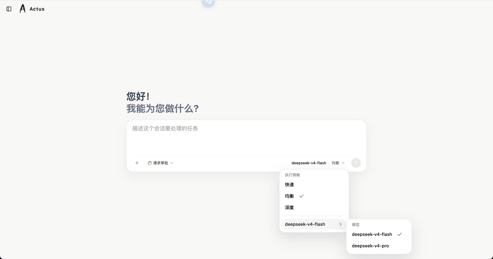
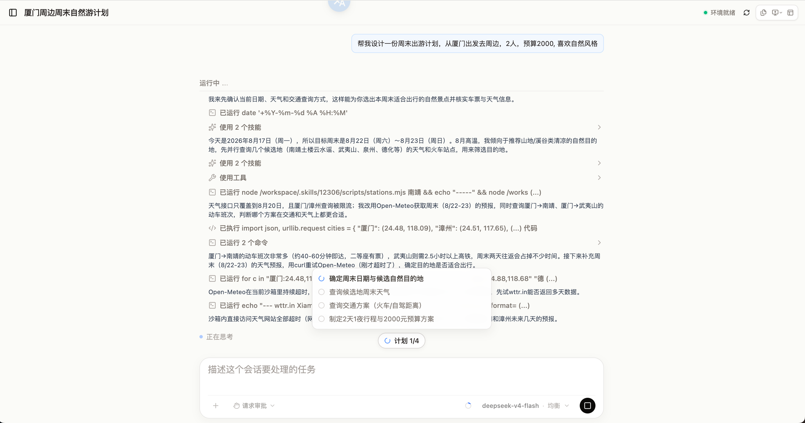
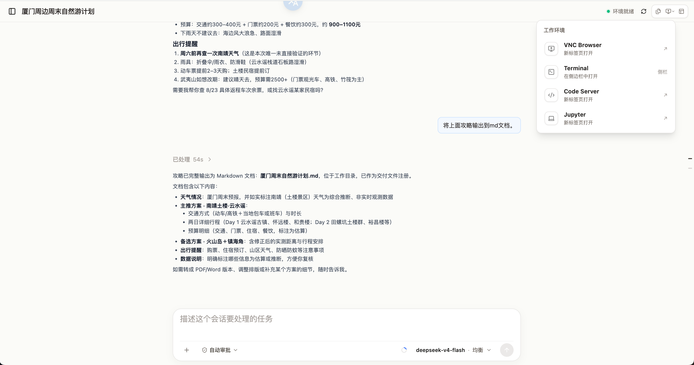
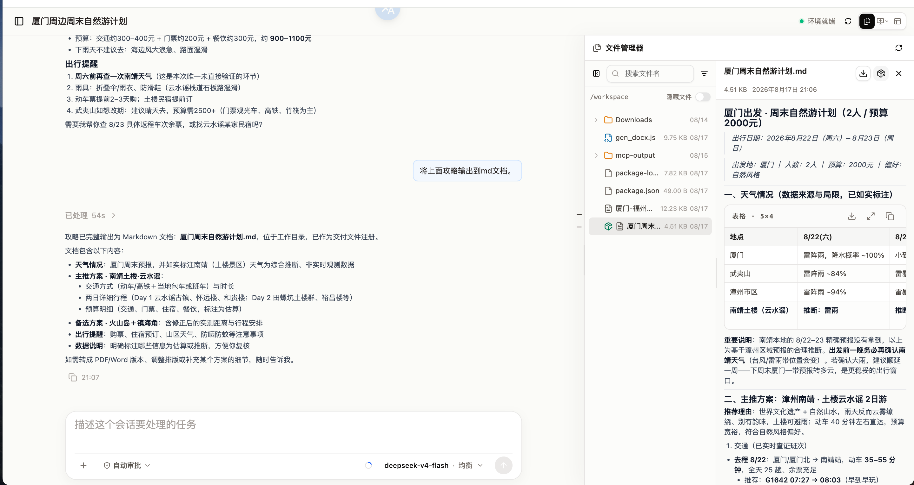

# Actus

<p align="center">
  <strong>🤖 任务执行 · 🌐 网页浏览 · 📁 文件处理 · 🧩 技能与应用</strong>
</p>

<p align="center">
  <a href="#-快速启动">快速启动</a> ·
  <a href="https://github.com/caixr9527/actus-community/releases">下载桌面端</a> ·
  <a href="#-桌面端">桌面端配置</a> ·
  <a href="https://github.com/caixr9527/actus-community/issues">反馈问题</a>
</p>

Actus 是一个 AI Agent 工作平台。描述你要完成的任务，Actus 会规划步骤、浏览网页、运行代码、处理文件并交付结果。你可以随时查看执行进度，并确认需要审批的操作。

<table>
  <tr>
    <td width="50%" align="center"><a href="assets/home.png"></a><br>首页</td>
    <td width="50%" align="center"><a href="assets/planning.png"></a><br>任务规划与执行</td>
  </tr>
  <tr>
    <td width="50%" align="center"><a href="assets/workspace.png"></a><br>工作环境</td>
    <td width="50%" align="center"><a href="assets/files.png"></a><br>文件管理器</td>
  </tr>
</table>

## 🚀 快速启动

安装 Docker（Docker Compose 2.23.1+）后，复制执行：

```bash
git clone https://github.com/caixr9527/actus-community.git
cd actus-community

docker compose up -d
```

等待服务启动完成，打开 **http://localhost:3000**，注册并登录。

### 配置模型

默认使用 DeepSeek。将下面的 `你的 API Key` 替换为自己的密钥，在仓库目录直接执行：

```bash
printf '%s\n' "UPDATE llm_model_configs SET api_key = :'api_key', updated_at = CURRENT_TIMESTAMP WHERE id = 'de1d9030-6946-45ae-a053-b0b47b3e8e03';" | docker compose exec -T postgres psql -X -U actus -d actus -v ON_ERROR_STOP=1 -v api_key='你的 API Key'
```

看到 `UPDATE 1` 即表示修改成功，刷新页面并新建会话即可开始使用。

<details>
<summary>更新、停止和查看日志</summary>

```bash
# 更新
git pull --ff-only
docker compose pull migration sandbox backend frontend
docker compose up -d --pull missing

# 停止（保留数据）
docker compose down

# 查看状态与日志
docker compose ps -a
docker compose logs --tail=100 backend frontend
```

升级前备份重要数据。不要使用 `docker compose down -v`，该命令会删除数据卷。

</details>

## 🔧 常用配置

默认配置可直接启动。需要调整时，在 `docker-compose.yml` 同级目录创建 `.env`，只填写需要修改的项：

| 配置项 | 用途 | 默认值 |
| --- | --- | --- |
| `FRONTEND_PORT` | 网页访问端口 | `3000` |
| `FRONTEND_BIND_ADDRESS` | `127.0.0.1` 仅本机访问，`0.0.0.0` 允许其他设备访问 | `127.0.0.1` |
| `PUBLIC_URL` | 用户实际访问的网址，用于登录授权回调和通知链接 | `http://localhost:3000`（随端口配置变化） |
| `SANDBOX_PUBLIC_URL` | 浏览器访问工作环境的地址 | `http://localhost:5678` |
| `AUTH_JWT_SECRET` | 登录令牌签名密钥；服务器部署时使用自己的随机字符串 | 内置本地默认值 |
| `POSTGRES_PASSWORD` | 数据库密码 | 内置本地默认值 |
| `REDIS_PASSWORD` | Redis 密码 | 内置本地默认值 |
| `MINIO_ROOT_PASSWORD` | 文件存储密码 | 内置本地默认值 |

例如，将本机访问端口改为 `8080`：

```dotenv
FRONTEND_PORT=8080
PUBLIC_URL=http://localhost:8080
```

保存后执行 `docker compose up -d` 生效，访问**http://localhost:8080。**

桌面端配置中的端口也需同步修改。数据库密码应在首次启动前设置，使用字母和数字；已有数据的数据库不能只修改 `.env` 完成密码变更。

## 🔒 HTTPS 部署

准备自己的域名和对应证书，将域名解析到部署服务器，并开放 **443** 端口。以下操作都在服务器上的 `actus-community` 目录中进行，也就是存放 `docker-compose.yml` 的目录。

**1. 放置证书**

在终端执行，创建证书文件夹：

```bash
mkdir -p certs
```

将自己的证书文件上传到这个文件夹：完整证书链命名为 `fullchain.pem`，无口令私钥命名为 `privkey.pem`。放好后的目录如下：

```text
certs/
├── fullchain.pem
└── privkey.pem
```

**2. 打开配置文件，填写自己的域名**

`.env` 是一个文本配置文件，与 `docker-compose.yml` 放在同一目录，Docker Compose 启动时会自动读取它。

在终端执行下面的命令，打开文件；如果文件不存在，保存时会自动创建：

```bash
nano .env
```

将下面的内容粘贴到编辑器中，**只需把 `actus.example.com` 换成自己的域名**，其余值照抄。例如你的域名是 `ai.example.cn`，第二行就写成 `PUBLIC_URL=https://ai.example.cn`。

如果文件中已有配置，保留其他配置；下面这些配置项如果已存在，就修改原来的那一行，不要重复添加。

**以下是文件内容，不是在终端执行的命令：**

```dotenv
COMPOSE_PROFILES=https
PUBLIC_URL=https://actus.example.com
TLS_CERT_DIR=./certs
FRONTEND_BIND_ADDRESS=127.0.0.1
AUTH_COOKIE_SECURE=true
AUTH_REQUIRE_HTTPS=true
```

粘贴并修改域名后，按 **Ctrl + O**，再按 **回车**保存；然后按 **Ctrl + X** 退出编辑器，回到终端。

**3. 启动 HTTPS 服务**

在终端执行（已经启动过服务也执行同一条命令）：

```bash
docker compose up -d
```

完成后，在浏览器打开你刚才填写的 `PUBLIC_URL`，例如 **https://ai.example.cn**。后续更新、停止仍使用前面的命令。证书到期前需自行更换；访问时请使用 `https://` 开头的地址。

<details>
<summary>通过 HTTPS 访问工作环境（Sandbox）</summary>

需要在远程浏览器打开工作环境时，为 Sandbox 配置单独域名，例如 `sandbox.example.com`，同样解析到服务器。

在 `certs` 中额外放入该域名的证书链 `sandbox-fullchain.pem` 和私钥 `sandbox-privkey.pem`。在终端执行 `nano .env`，在文件末尾添加以下内容，将两处 `sandbox.example.com` 换成自己的 Sandbox 域名（已有同名配置项时修改原来的行）：

```dotenv
SANDBOX_HTTPS_ENABLED=true
SANDBOX_HTTPS_HOST=sandbox.example.com
SANDBOX_PUBLIC_URL=https://sandbox.example.com
```

按 **Ctrl + O**、**回车**保存，再按 **Ctrl + X** 退出，然后在终端执行 `docker compose up -d` 生效。无需开放 `5678` 端口；Sandbox 入口没有登录认证，应通过防火墙或上游代理限制访问来源。

</details>

## 🖥️ 桌面端

在 [Releases](https://github.com/caixr9527/actus-community/releases) 下载 Windows 安装包 `Actus_<版本>_x86_64-setup.exe`，安装后连接已启动的服务。

首次启动桌面端后，按 `Win + R` 打开以下目录，编辑其中的 `config.toml`：

```text
%APPDATA%\com.actus.desktop
```

**连接本机部署：**

```toml
[server]
api_url = "http://localhost:3000/api"
web_url = "http://localhost:3000"
```

**连接远程服务：**

```toml
[server]
api_url = "https://你的域名/api"
web_url = "https://你的域名"
```

`api_url` 填写服务地址并以 `/api` 结尾，`web_url` 填写网页访问地址。远程服务使用 HTTPS；`localhost` 仅用于服务和客户端位于同一台电脑的情况。

保存后，**完全退出桌面端并重新启动**。配置在升级时保留。后续可在账户菜单中检查更新。

## 💬 反馈

欢迎通过 [Issues](https://github.com/caixr9527/actus-community/issues) 反馈问题或提出建议。
